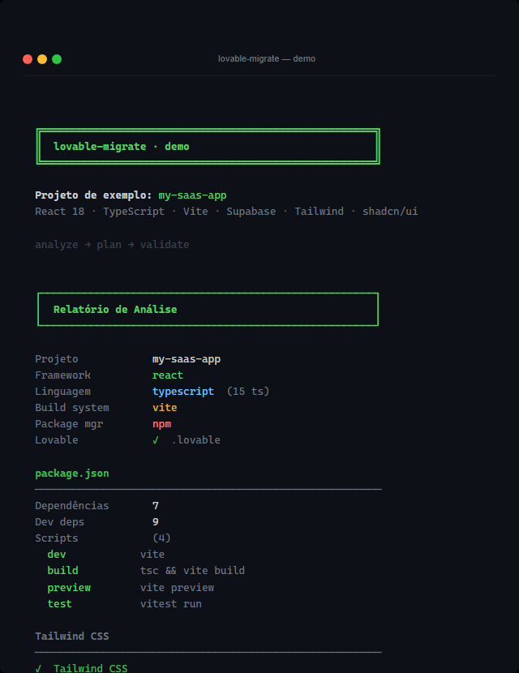

# lovable-migrate

> **From Lovable.dev to production in one command.**

[](https://www.npmjs.com/package/lovable-migrate)
[](https://github.com/dynhosilva/migrator/actions/workflows/ci.yml)
[](LICENSE)
[](https://nodejs.org/)

🇧🇷 [Versão em português](README.pt-BR.md)

---

```bash
npx lovable-migrate demo   # see it in action — no install required
```

<p align="center">
  
</p>

Automatically detects your stack, identifies Supabase (auth, storage, migrations, edge functions), generates a multi-stage Dockerfile, creates ready-to-use GitHub Actions workflows, and plans the remote deployment — **without modifying your original project.**

---

## Quick Start

```bash
# See it in action — no install, no project needed
npx lovable-migrate demo

# Full pipeline — generates all artifacts
lovable-migrate deploy ./my-project --output ./output/my-project

# Interactive wizard — recommended for first-time users
lovable-migrate ui
```

---

## How It Works

```
1. Analyze    → detects framework, Supabase, env vars, routes, build system
2. Plan       → generates deploy strategy, risk list, and migration checklist
3. Generate   → Dockerfile + GitHub Actions + execution plan — in seconds
```

Your original project is never modified. All artifacts go to `--output`.

---

## What You Get

Run `lovable-migrate deploy ./my-project` and receive immediately:

```
output/my-project/
├── .github/
│   └── workflows/
│       ├── ci.yml              # CI: push + PR · Node [20, 22] · npm cache
│       └── release.yml         # Release: tag v* · npm publish --dry-run
├── docker/
│   ├── Dockerfile              # Multi-stage optimized for your stack
│   ├── docker-compose.yml      # With healthcheck and volumes configured
│   └── .dockerignore
├── env/
│   └── .env.example            # All detected environment variables
├── deploy/
│   └── deploy-instructions.md  # Ready-to-copy commands
├── execution/
│   ├── execution-plan.json
│   └── dry-run.md              # Preview before executing anything
└── reports/
    └── migration-summary.json
```

If Supabase is detected, also generates:

```
├── supabase/
│   ├── migrations/             # Migration copies ready to apply at destination
│   └── functions/<name>/      # Edge Functions ready for Supabase CLI deploy
```

---

## Terminal Preview

<p align="center">
  
</p>

```
$ npx lovable-migrate demo

  ╔══════════════════════════════════════════════════════╗
  ║  lovable-migrate · demo                              ║
  ╚══════════════════════════════════════════════════════╝

  Sample project: my-saas-app
  React 18 · TypeScript · Vite · Supabase · Tailwind · shadcn/ui

  ┌──────────────────────────────────────────────────────┐
  │  Analysis Report                                     │
  └──────────────────────────────────────────────────────┘

  Project            my-saas-app
  Framework          react
  Language           typescript  (15 ts)
  Build system       vite
  Package mgr        npm
  Lovable            ✓  .lovable

  Supabase
  ──────────────────────────────────────────────────────
  ✓  Detected
  ✓  Auth
  ✓  Storage
  ✓  Realtime
  Migrations         2 files
    20240101000000_initial.sql
    20240115000000_add_teams.sql
  Edge Functions     2
    send-email
    process-payment

  Environment variables
  ──────────────────────────────────────────────────────
  VITE_SUPABASE_URL
  VITE_SUPABASE_ANON_KEY
  VITE_APP_URL
  VITE_STRIPE_PUBLIC_KEY

  Routes
  ──────────────────────────────────────────────────────
  /  ·  /auth  ·  /dashboard
  /settings  ·  /profile

  [ ... Migration Plan · Checklist · Validation ... ]

  ┌──────────────────────────────────────────────────────┐
  │  What deploy would generate for this project         │
  └──────────────────────────────────────────────────────┘

  GitHub Actions
  ✓  .github/workflows/ci.yml         push + PR · Node [20, 22] · npm cache
  ✓  .github/workflows/release.yml    tag v* · npm publish --dry-run

  Docker
  ✓  docker/Dockerfile                multi-stage · nginx:alpine
  ✓  docker/docker-compose.yml        healthcheck · volumes
  ✓  docker/.dockerignore

  Configuration
  ✓  env/.env.example                 4 variables detected
  ✓  deploy/deploy-instructions.md    ready-to-copy commands
  ✓  supabase/migrations/             2 SQL files
  ✓  supabase/functions/              2 Edge Functions

  Execution and planning
  ✓  execution/execution-plan.json
  ✓  execution/dry-run.md             preview without running anything
  ✓  reports/migration-summary.json

  ━━━━━━━━━━━━━━━━━━━━━━━━━━━━━━━━━━━━━━━━━━━━━━━━━━━━━━

  ✓  Analysis complete — no blockers detected.

  Ready to migrate your real project?

    lovable-migrate deploy ./my-project
    lovable-migrate ui               interactive wizard — recommended
```

> **Note:** The CLI output is in Brazilian Portuguese. The engine, types, and API are in English.

---

## Installation

```bash
npm install -g lovable-migrate
lovable-migrate --version   # verify installation
```

**Requirement:** Node.js >= 20.0.0

---

## Pipeline

Each command runs all previous phases plus its own:

```
analyze   → detects stack, framework, env vars, Supabase
plan      → generates deploy strategy and risk list
validate  → security gate — blocks unsafe migrations
migrate   → generates artifacts (env, SQL, instructions)
deploy    → generates Dockerfile + docker-compose
cicd      → generates .github/workflows/ci.yml and release.yml
execute   → verifies environment + generates execution plan
remote    → plans remote deployment (no real SSH)
```

```bash
# Analysis only — zero side effects
lovable-migrate analyze ./project

# Generate Dockerfile + artifacts + GitHub Actions
lovable-migrate deploy ./project --output ./output

# Plan remote deployment
lovable-migrate remote ./project \
  --ssh-host my-server.com \
  --ssh-user deploy \
  --remote-path /opt/my-app
```

---

## Supported Stacks

| Framework | Build System | Deploy Strategy |
|---|---|---|
| React | Vite, CRA, Webpack | Static (nginx) |
| Vue 3 | Vite | Static (nginx) |
| Svelte / SvelteKit | Vite | Static (nginx) |
| Next.js | Next | Node Server |
| Node API | — | Docker (node) |
| Static HTML | — | Static (nginx) |

**Package managers:** npm, yarn, pnpm, bun

**Auto-detected:** Supabase (auth, storage, migrations, edge functions), Tailwind, Shadcn/ui

---

## GitHub Actions

The `deploy` command automatically generates two ready-to-use workflows:

**`.github/workflows/ci.yml`** — runs on every push and pull request:

```yaml
# Generated by lovable-migrate — do not edit manually
name: CI
on:
  push:
    branches:
      - main
  pull_request:
    branches:
      - main
jobs:
  build:
    runs-on: ubuntu-latest
    strategy:
      matrix:
        node-version:
          - 20
          - 22
    steps:
      - uses: actions/checkout@v4
      - name: Set up Node.js ${{ matrix.node-version }}
        uses: actions/setup-node@v4
        with:
          node-version: ${{ matrix.node-version }}
          cache: npm
      - name: Install dependencies
        run: npm ci
      - name: Build
        run: npm run build
      - name: Test          # included only if scripts.test exists in package.json
        run: npm test
```

**`.github/workflows/release.yml`** — runs when pushing a `v*` tag:

```yaml
# Generated by lovable-migrate — do not edit manually
name: Release
on:
  push:
    tags:
      - v*
jobs:
  publish:
    runs-on: ubuntu-latest
    steps:
      - uses: actions/checkout@v4
      - name: Set up Node.js
        uses: actions/setup-node@v4
        with:
          node-version: 20
          registry-url: https://registry.npmjs.org
          cache: npm
      - name: Install dependencies
        run: npm ci
      - name: Build
        run: npm run build
      - name: Publish (dry-run)
        run: npm publish --dry-run  # safe by default — no NPM_TOKEN required
```

### Philosophy

| Principle | Implementation |
|---|---|
| **Deterministic** | Same project → same YAML, on any machine, on every run |
| **Safe by default** | `npm publish --dry-run` — no effect until you opt in |
| **Zero secrets** | No `secrets.*` references in the generated file |
| **Zero cloud coupling** | No GitHub API, no OIDC, no vendor lock-in — just static YAML |
| **Project-conditional** | `build` and `test` steps included only if the scripts exist |

To enable real publishing in release.yml, add the environment variable manually:

```yaml
      - name: Publish
        run: npm publish
        env:
          NODE_AUTH_TOKEN: ${{ secrets.NPM_TOKEN }}
```

Real generated examples: [`examples/generated-workflows/`](examples/generated-workflows/)

Full documentation: [docs/cicd.md](docs/cicd.md)

---

## TUI — Interactive Wizard

```bash
lovable-migrate ui
```

The wizard guides you through each phase with interactive review at every step:

```
Welcome
  → Enter project path
  → [Automatic Analyze + Plan]
  → Review detected stack
  → Review plan and risks
  → Review validation result
  → Confirm before writing to disk
  → [Migrate + Deploy + Execute + Remote]
  → Review generated dry-run
  → Final summary with artifact access
```

---

## HTTP API

```bash
lovable-migrate server --port 3001
```

```bash
# Health check
curl http://localhost:3001/health

# Analyze a project
curl -X POST http://localhost:3001/analyze \
  -H "Content-Type: application/json" \
  -d '{"input": "/path/to/project"}'

# Full pipeline
curl -X POST http://localhost:3001/deploy \
  -H "Content-Type: application/json" \
  -d '{"input": "/path/to/project", "output": "./output/my-project"}'
```

**Available endpoints:** `/health` · `/version` · `/capabilities` · `/analyze` · `/plan` · `/validate` · `/migrate` · `/deploy` · `/execute` · `/remote`

Full documentation: [docs/api.md](docs/api.md)

---

## Philosophy

### The original project is never modified

All artifacts are generated in a separate output directory. `lovable-migrate` reads the project, analyzes it, and writes only to `--output`. It never touches the original files.

### Dry-run by default

Before any real operation, the pipeline generates a `dry-run.md` with a complete preview of everything that would be executed. You review before confirming.

### Conservative by design

When there isn't enough data for a safe decision, the planner uses `confidence: unknown` and lists risks explicitly. No silent assumptions.

### Execution sandbox

The runtime executes only a strict whitelist of executables (`node`, `npm`, `npx`, `pnpm`, `yarn`, `bun`, `docker`) with `shell: false` — argument injection is impossible at the OS level.

### Explicit validation

The `validate` phase can block the pipeline with `safeToMigrate: false`. To proceed in cases where you know what you're doing (e.g., env vars not yet configured on the server), use `--force`.

---

## Architecture

```
ProjectContext (immutable — pipeline backbone)
     │
     ├── analyzeContext()   → AnalysisReport
     │     DetectorRegistry (10 independent detectors)
     │
     ├── planContext()      → MigrationPlan
     │     PlannerRegistry (7 strategies)
     │
     ├── validateContext()  → ValidationResult
     │     ValidationRegistry (7 rules)
     │
     ├── migrateContext()   → MigrationResult     [writes disk]
     ├── deployContext()    → DeployState          [writes disk]
     ├── cicdContext()      → CicdState            [writes disk]
     ├── executeContext()   → ExecutionState       [writes disk]
     ├── runContext()       → RuntimeState         [runs commands]
     └── prepareContext()   → RemoteState          [pure planning]

Transport layers (no domain logic):
     ├── CLI     — Commander
     ├── API     — Fastify (thin layer)
     └── TUI     — Ink/React (wizard)
```

Each phase receives `ProjectContext` and returns a **new** context via spread — immutability guaranteed. Adding a new phase doesn't require changing the orchestrator.

Detailed documentation: [docs/architecture.md](docs/architecture.md) · [docs/architecture-overview.md](docs/architecture-overview.md)

---

## Examples

See the [`examples/`](examples/) folder for working projects:

| Example | Stack | Demonstrates |
|---|---|---|
| [`strat-forge-pro`](examples/strat-forge-pro/) | React + Vite + Supabase + Bun | Real project exported from Lovable.dev |
| [`vite-react`](examples/vite-react/) | React + Vite + TypeScript | Most common case — static deploy |
| [`next-supabase`](examples/next-supabase/) | Next.js + Supabase | Node server deploy + database |
| [`minimal-static`](examples/minimal-static/) | HTML + JS | Minimal project without framework |
| [`vue-vite`](examples/vue-vite/) | Vue 3 + Vite | Alternative stack |
| [`node-api`](examples/node-api/) | Node.js + Express | Backend without frontend |

---

## Roadmap

| Status | Item |
|---|---|
| ✅ | Analyze — stack, framework, Supabase detection |
| ✅ | Plan — deploy strategy and migration plan |
| ✅ | Validate — security gate with explicit blocking |
| ✅ | Migrate — filesystem artifact generation |
| ✅ | Deploy — multi-stage Dockerfile + docker-compose |
| ✅ | Execute — environment check + execution plan |
| ✅ | Runtime — controlled local build with sandbox |
| ✅ | Remote — remote deployment planning |
| ✅ | HTTP API — Fastify with rate limiting |
| ✅ | TUI — interactive wizard (Ink/React) |
| ✅ | GitHub Actions generator — deterministic ci.yml + release.yml |
| 🔲 | Re-sync — re-synchronization with Lovable / Supabase |
| 🔲 | Hostinger integration — automatic VPS deployment |
| 🔲 | Supabase CLI integration — automatic migration execution |

Full roadmap: [ROADMAP.md](ROADMAP.md)

---

## Security

- No phase modifies the original project
- All disk writes validate that the path is inside `outputDir`
- Runtime uses a sandbox with executable whitelist and `shell: false`
- Remote doesn't open real SSH connections
- API validates schema and blocks extra fields by default
- Default rate limiting: 200 req/min per IP

To report vulnerabilities: [SECURITY.md](SECURITY.md)

---

## Contributing

Contributions are welcome! See [CONTRIBUTING.md](CONTRIBUTING.md) for the full guide.

```bash
git clone https://github.com/dynhosilva/migrator
cd lovable-migrate
npm install
npm run dev -- demo           # see the demo running
npm run dev -- analyze ./examples/vite-react
```

---

## Documentation

| Document | Description |
|---|---|
| [Getting started](docs/getting-started.md) | Installation and first project |
| [CLI reference](docs/cli.md) | All commands and flags |
| [HTTP API](docs/api.md) | Endpoints and response envelopes |
| [TUI](docs/tui.md) | Interactive wizard — navigation and shortcuts |
| [Architecture](docs/architecture.md) | Pipeline, modules, and design decisions |
| [Public overview](docs/architecture-overview.md) | Architecture for contributors |
| [Runtime](docs/runtime.md) | Safe execution — sandbox and whitelist |
| [Remote deploy](docs/remote.md) | SSH planning and host profiles |
| [GitHub Actions](docs/cicd.md) | Workflow generation — architecture, builders, philosophy |
| [Development](docs/development.md) | Setup, tests, and how to add phases |
| [Screenshots](docs/screenshots.md) | Guide for promotional captures |
| [GIF storyboard](docs/gif-storyboard.md) | Demo GIF narrative and sequence |
| [GIF production](docs/gif-production.md) | Exact commands to record and export the GIF |
| [Social preview](docs/social-preview.md) | Social preview image specs (GitHub, Twitter, LinkedIn) |
| [Launch assets](docs/launch-assets.md) | Tweet, Product Hunt, YouTube — launch copy |
| [Social assets](docs/social-assets.md) | Image templates by platform |

---

## License

[MIT](LICENSE) — © 2026 lovable-migrate contributors
